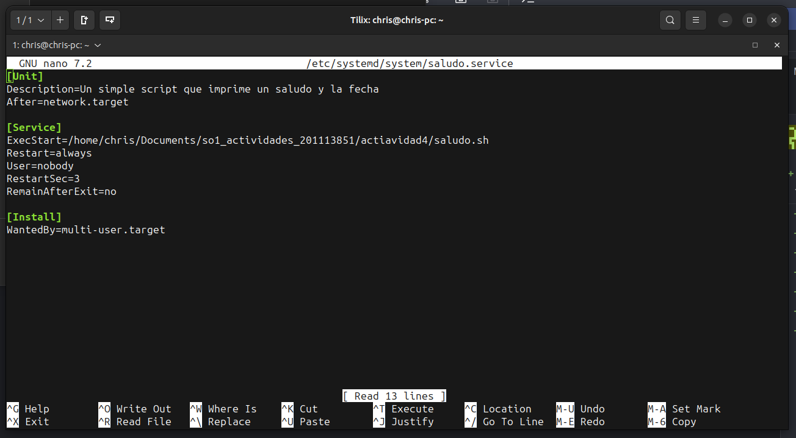
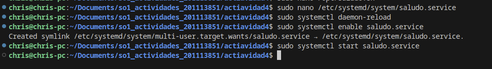
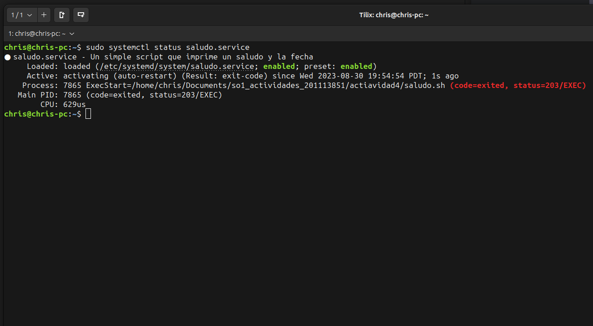
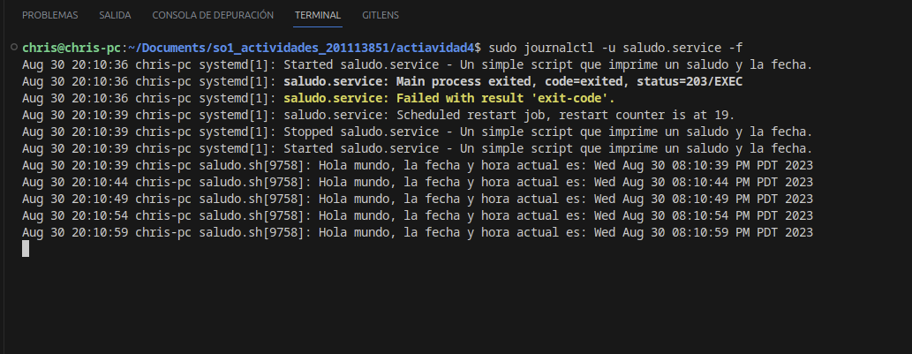

# Servicio de Saludo

Este es un simple servicio que imprime un saludo y la fecha actual cada 5 segundos.

## Instalación

1. Se coloco `saludo.sh` en la ubicación `/opt/` y se le otorgo permisos de ejecucion

```

sudo chmod +x /opt/saludo.sh

```

2. Se Escribio el archivo `saludo.service` en la ubicación `/etc/systemd/system/`.



3. Se Ejecuto los siguientes comandos para habilitar y comenzar el servicio:

```

sudo systemctl daemon-reload
sudo systemctl enable saludo.service
sudo systemctl start saludo.service

```





## Verificación

Para verificar que el servicio está funcionando, puedes ver los logs:

```

sudo journalctl -u saludo.service -f

```


